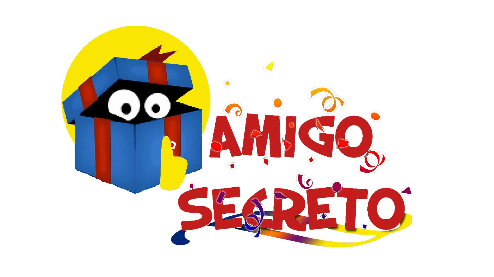

<h1 align = "center"> CHALLENGE AMIGO SECRETO</h1>

   	

Amigo Secreto es una aplicación web interactiva que permite a los usuarios ingresar una lista de amigos y sortear aleatoriamente un nombre para designar al "amigo secreto". El objetivo principal de este proyecto es fortalecer habilidades en lógica de programación, manipulación del DOM y uso de JavaScript para la gestión de eventos y actualización dinámica de la interfaz.

# Funcionalidades del proyecto 

- 🟢  **`Agregar Amigo:`** Los usuarios escribirán el nombre de un amigo en un campo de texto y lo agregarán a una lista visible al hacer clic en "Adicionar".
- `Validar Entrada:` Si el campo de texto está vacío, el programa mostrará una alerta pidiendo un nombre válido.
- `Visualizar la lista :` Los nombres ingresados aparecerán en una lista debajo del campo de entrada.

- `Sorteo Aleatorio:`Al hacer clic en el botón "Sortear Amigo", se seleccionará aleatoriamente un nombre de la lista y se mostrará en la página. 

# Tecnologias utilizadas 🔧
- HTML
- CSS
- JavaScript
